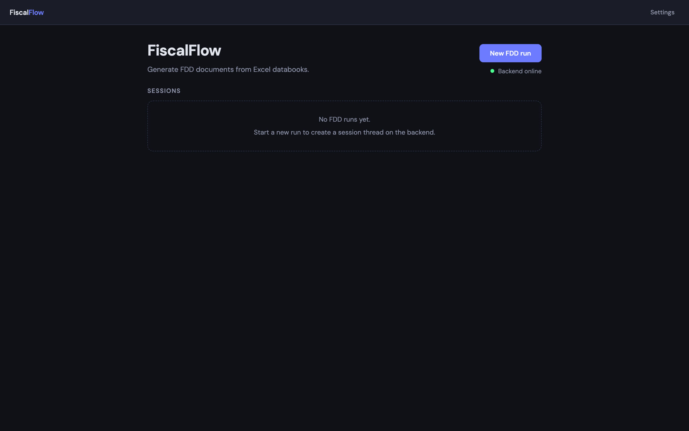
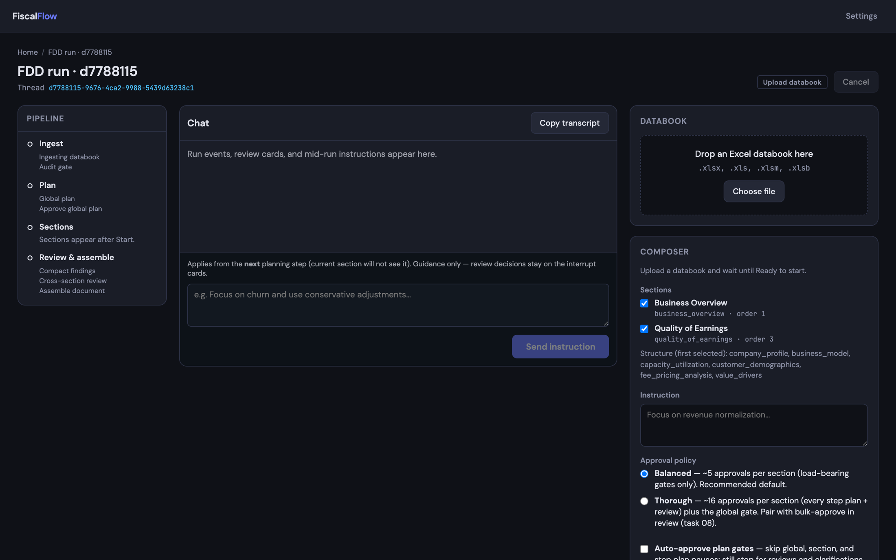
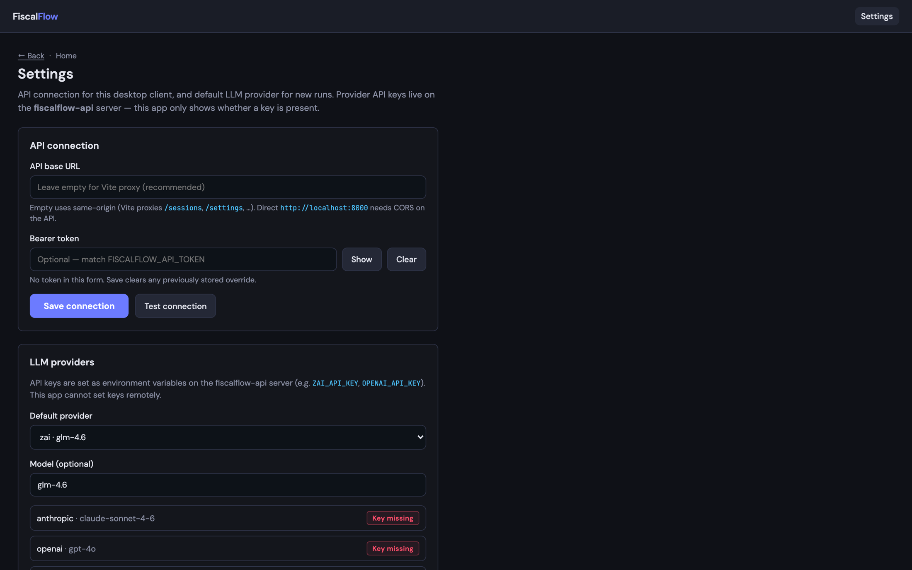
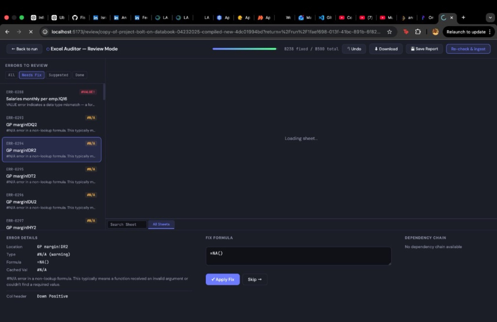

# FiscalFlow UI

React + **Tauri 2** desktop client for FiscalFlow. Upload Excel databooks, run the
SSE-streamed FDD pipeline against [fiscalflow-api](https://github.com/FiscalFlowHQ/fiscalflow-api),
review human-in-the-loop pauses, and **export** the assembled report
(`GET /sessions/{id}/document?format=md|pptx|pdf`).

```
┌─────────────┐     REST + SSE      ┌──────────────────┐
│ fiscalflow  │ ──────────────────► │  fiscalflow-api  │
│ ui (Vite /  │   localhost:8000    │  FastAPI+LangGraph│
│ Tauri shell)│ ◄────────────────── │  checkpointer     │
└─────────────┘                     └──────────────────┘
        │                                      │
        │ localStorage sessions / settings     │ Excel → ingest
        ▼                                      ▼
   /run/:threadId                      outputs/<thread>/…
   Databook · Pipeline · Artifacts     report.md / .pptx / .pdf
   Chat · HITL · Export
```

The csv-fixer **audit review** flow is available only when `FISCALFLOW_SKIP_AUDIT=false`
and a databook fails ExcelAuditor: use **Review errors** → `/review/:auditId`.
By default (`FISCALFLOW_SKIP_AUDIT=true`, same as `run_pilot.py --skip-audit`) upload
goes straight to extract & index using your LLM/embedding env settings.

## Screenshots

Walkthrough (autoplay-friendly H.264):

[](docs/screenshots/demo.mp4)

<p align="center"><em><a href="docs/screenshots/demo.mp4">Watch the desktop demo (MP4)</a></em></p>

<p align="center">
  
</p>
<p align="center"><em>Home — start a new FDD run</em></p>

<p align="center">
  
</p>
<p align="center"><em>Workspace — pipeline, chat, databook upload, and composer</em></p>

<p align="center">
  
</p>
<p align="center"><em>Settings — API connection and LLM providers</em></p>

<p align="center">
  
</p>
<p align="center"><em>Excel Auditor — review and fix spreadsheet errors</em></p>

## Stack

| Layer | Technology |
|-------|------------|
| UI | React 19 + TypeScript |
| Build | Vite 6 |
| Desktop | Tauri 2 (`src-tauri/`) |
| Routing | react-router-dom |
| API | `fetch` + SSE → fiscalflow-api |

## Requirements

### Web / UI

- Node.js 18+ and npm
- Sibling [fiscalflow-api](https://github.com/FiscalFlowHQ/fiscalflow-api) on port **8000**

### Desktop (Tauri)

- **Rust** 1.77.2+ (`rustup`)
- macOS: Xcode Command Line Tools (`xcode-select --install`)
- Windows / Linux: see [Tauri prerequisites](https://v2.tauri.app/start/prerequisites/)

## Setup

```bash
git clone https://github.com/FiscalFlowHQ/fiscalflow-ui.git
cd fiscalflow-ui
npm install
cp .env.example .env   # optional overrides
```

## Environment

| Variable | Role |
|----------|------|
| `VITE_API_BASE_URL` | Empty = Vite proxy (browser) or Tauri’s runtime default `http://localhost:8000`. Release Tauri builds inject localhost:8000. |
| `VITE_API_TOKEN` | Optional bearer; must match `FISCALFLOW_API_TOKEN` on the API |
| Settings UI | Runtime overrides in `localStorage` key `fiscalflow.settings.v1` |

API-side (not in this repo): `ZAI_API_KEY` / provider keys, `FISCALFLOW_CORS_ORIGINS`,
`FISCALFLOW_API_TOKEN`.

## Run — browser

**Terminal 1 — API:**

```bash
cd ../fiscalflow-api
source .venv/bin/activate
uvicorn app.main:app --reload --port 8000
```

**Terminal 2 — UI:**

```bash
npm run dev
```

Open http://localhost:5173 — Vite proxies `/sessions`, `/documents`, `/settings`, `/sections`,
`/health` to the API.

## Run — desktop

1. Start fiscalflow-api on **:8000** (no sidecar auto-start in MVP).
2. `npm run tauri:dev`

CORS example when the webview origin is not the API’s default:

```bash
export FISCALFLOW_CORS_ORIGINS="http://localhost:5173,http://localhost:1420,tauri://localhost,http://tauri.localhost,https://tauri.localhost"
```

## Build & test

```bash
npm test
npm run build
npm run tauri:build   # requires Rust; artifacts under src-tauri/target/release/bundle/
```

## Routes

| Path | Description |
|------|-------------|
| `/` | Session home — health check, New FDD run |
| `/run/:threadId` | Run workspace |
| `/settings` | API URL, token, LLM provider defaults |
| `/upload`, `/review/*` | Redirect → `/` (legacy audit parked) |

## Export

After `run_status: completed`, the **Report** tab feature-detects formats from
`values.metadata.artifacts` (`markdown` → Download Markdown, plus pptx/pdf when present).
Downloads use **only** `GET /sessions/{id}/document?format=`. Server paths are never
treated as browser-readable content.

## Fixture databook

Use `fiscalflow-api/tests/fixtures/sample_databook.xlsx` for upload/ingest smoke tests.

## Status

**v0.1 — MVP.** Acceptance checklist lives in `.claude/plans/tasks/task-15-acceptance.md`
Handoff notes.

## License

Proprietary — FiscalFlowHQ
